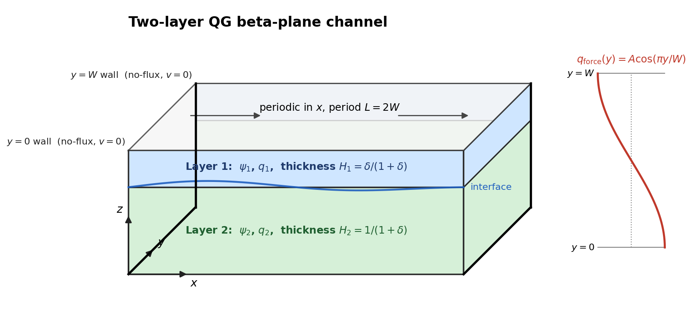
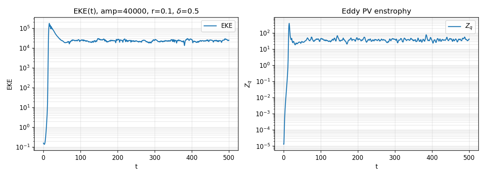
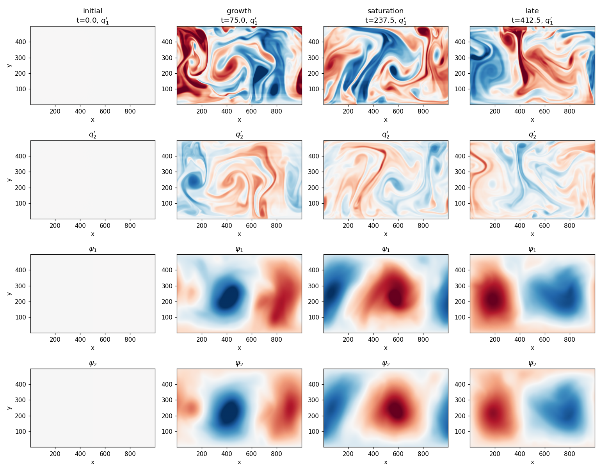
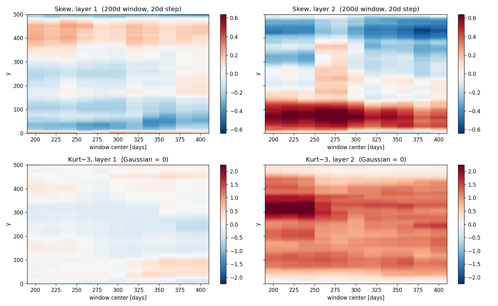

# qg2c-channel

A two-layer quasi-geostrophic (QG) channel model on a beta plane, ported from
the original MATLAB reference solver of Glenn Flierl in class MIT-12.820 to Python (numpy/scipy) and
to JAX/GPU. Used to study baroclinic instability, eddy saturation, and
filament formation in the lower layer.

Both backends solve the same equations bit-for-bit (to float64 precision); the
JAX backend is roughly **25-50× faster** than the scipy reference at
`nx=256, ny=128` on a single A100.


*Eddy PV `q'` in upper (left) and lower (right) layers for the Rd=20,
δ=0.5 case (see "Example: filament run" below).*

---

## Model

### Geometry

A periodic zonal channel of length `L = 2W` with rigid walls at `y = 0` and
`y = W`. Two active layers of thickness `H1 = δ H2 / (1+δ)` and
`H2 = 1 / (1+δ)` (non-dimensional, sum to 1).



### Equations

$\psi_k$ is the geostrophic stream function in layer $k$, $q_k$ the eddy PV
anomaly, $R_d$ the deformation radius, and $\delta = H_1 / H_2$ the
layer-thickness ratio.

**Stream function ↔ PV inversion** (layer 1 and layer 2 written out):

$$q_1 = \nabla^2 \psi_1 + F_1 (\psi_2 - \psi_1)$$

$$q_2 = \nabla^2 \psi_2 + F_2 (\psi_1 - \psi_2)$$

with

$$F_1 = \frac{1}{R_d^2 (1+\delta)}, \qquad F_2 = \delta F_1$$

**Velocities** (same form in both layers):

$$u_k = -\frac{\partial \psi_k}{\partial y}, \qquad v_k = \frac{\partial \psi_k}{\partial x}, \qquad k = 1, 2$$

**Total PV** (eddy PV plus planetary background $\beta y$, with $W/2$ subtracted
so that $\beta(y - W/2)$ has zero channel mean):

$$Q_1 = q_1 + \beta (y - W/2)$$

$$Q_2 = q_2 + \beta (y - W/2)$$

**Evolution.** Layer 1:

$$\frac{\partial q_1}{\partial t} + \frac{\partial (u_1 Q_1)}{\partial x} + \frac{\partial (v_1 Q_1)}{\partial y} = - r F_1 q_F(y) - r_1 q_1$$

Layer 2:

$$\frac{\partial q_2}{\partial t} + \frac{\partial (u_2 Q_2)}{\partial x} + \frac{\partial (v_2 Q_2)}{\partial y} = + r F_2 q_F(y) - r_2 q_2$$

The meridional cosine forcing is

$$q_F(y) = A \cos(\pi y / W)$$

- $r$ is the **thermal-relaxation rate** that drives the radiative-equilibrium
  vertical shear (acts with opposite signs on the two layers, so it
  sets up but does not directly damp the barotropic mode).
- $r_1, r_2$ are **per-layer Ekman friction**. Setting $r_1 = r_2 = r$
  recovers the original symmetric MATLAB model; setting them independently
  lets you e.g. remove upper-layer friction while keeping the thermal
  forcing intact.

### Boundary conditions

| Direction | Condition |
|-----------|-----------|
| $x$ (zonal)        | Periodic with period $L = 2W$ |
| $y = 0,\,W$ walls  | $v = \partial_x \psi = 0$ (rigid free-slip wall) |
| $y = 0,\,W$ walls  | $\psi'_i = 0$ for the eddy part (Dirichlet); the zonal-mean stream function uses a no-flux Neumann condition on $\bar{\psi}_y$ |
| $y = 0,\,W$ walls  | No meridional PV flux (the advective $v Q$ flux is clipped to 0 on the walls) |

### Numerical scheme

- **PV inversion:** DCT-II for the zonal-mean ($\bar{\psi}$, no-flux walls),
  DST-I along $y$ + FFT along $x$ for the eddies ($\psi'$, Dirichlet walls
  + periodic). Mass-adjustment via a free barotropic mode
  $\cosh((y - W/2)/R_d)$ that keeps total channel mass conserved.
- **Time stepping:** explicit. Each step uses an Adams-Bashforth-style
  extrapolation $q^{n+1/2} = 1.5 q^n - 0.5 q^{n-1}$ to evaluate
  velocities at the half-step, then a forward Euler update from $q^{n-1}$.
- **Advection:** van Leer flux-limited upwind in both $x$ and $y$.

The numerical implementation lives in:
- [`src/qg2c.py`](src/qg2c.py) — numpy/scipy reference solver
- [`src/qg2c_jax.py`](src/qg2c_jax.py) — JAX port with `@jit`'d step; uses
  direct matrix-multiply DCT/DST at the resolutions of interest (cheap on
  GPU).

### Parameters

| Symbol | CLI flag | Default | Meaning |
|---|---|---|---|
| $A$        | `--amp`    | `4e4`     | Forcing amplitude (sets eddy-saturation level) |
| $r$        | `--r`      | `0.1`     | Thermal-relaxation rate |
| $r_1, r_2$ | `--r1 --r2`| `r`       | Ekman friction per layer (default symmetric) |
| $\delta$   | `--delta`  | `0.2`     | Layer-thickness ratio $H_1/H_2$ |
| $\beta$    | `--beta`   | `1.728e-3`| Planetary-vorticity gradient |
| $R_d$      | `--Rd`     | `40`      | Rossby deformation radius |
| $W$        | (fixed in `setup_params`)  | `500` | Channel width; $L = 2W$ |
| $n_x, n_y$ | `--nx --ny`| `128, 64` | Grid resolution |
| $\Delta t$ | `--dt`     | `1/128`   | Time step |
| $t_{\max}$ | `--tmax`   | `150`     | Integration time (model "days") |
| seed       | `--seed`   | `0`       | RNG seed for initial condition |

The full list (initial-condition style, save cadence, etc.) is in
[`src/run_single.py`](src/run_single.py).

---

## Quick start

```bash
# 1. Environment (numpy + scipy + matplotlib at minimum; jax for the GPU path)
pip install -r requirements.txt

# 2. Smoke test: short run on CPU with the reference solver
python src/run_single.py \
    --amp 4e4 --tmax 50 --nx 128 --ny 64 \
    --detailed --analyze --label smoke

# 3. GPU run via the JAX backend
python src/run_single.py \
    --amp 4e4 --r 0.10 --r1 0.04 --r2 0.04 \
    --delta 0.5 --Rd 20 --beta 8.64e-4 \
    --seed 1 --init-style matlab-sin-noise --noise-amp 1e-3 \
    --nx 512 --ny 256 \
    --tmax 500 --dt 0.00048828125 --dt-save-fields 2.0 \
    --backend jax --detailed --analyze \
    --label filament_Rd20
```

On a SLURM cluster, the [`slurm/`](slurm) folder contains two minimal
templates — one for the CPU backend, one for the GPU backend. Edit the
python invocation, then `sbatch slurm/submit_jax_gpu.sbatch`.

---

## Example run

500-day integration at $R_d = 20$, $\delta = 0.5$, $\beta = 8.64 \times 10^{-4}$,
$A = 4\times 10^{4}$, $r = 0.10$, $r_1 = r_2 = 0.04$, $n_x \times n_y = 512 \times 256$,
$\Delta t = 1/2048$, matlab-sin-noise initial condition with seed 1.

**Bulk energetics — exponential growth then eddy saturation:**



**Snapshots through the run (rows: q'₁, q'₂, ψ₁, ψ₂; columns: initial,
growth, saturation, late):**



**Sliding-window (200 d, 20 d step) skewness and excess kurtosis vs y.
In this regime, the statistics is nearly Gaussian.**



---

## Repo layout

```
qg2c-channel/
├── README.md
├── requirements.txt
├── src/
│   ├── qg2c.py             # numpy/scipy reference solver
│   ├── qg2c_jax.py         # JAX/GPU port (same equations)
│   ├── run_one_case.py     # per-case driver + diagnostics
│   ├── run_single.py       # CLI wrapper around run_one_case
│   ├── diagnostics.py      # EKE, Zq, spectra, skew/kurt, growth fit
│   └── analyze_baseline.py # post-run plotting pipeline (figs 01/03/05/07/10/11)
├── slurm/
│   ├── submit_jax_gpu.sbatch
│   └── submit_cpu.sbatch
└── docs/
    ├── channel_diagram.svg
    └── figures/             # README assets
```

---

## Acknowledgements

Port of the MIT 12.820 (Geophysical Fluid Dynamics II) reference MATLAB
solver. JAX/GPU port and asymmetric-friction extension by
[@zhangqingqi](https://github.com/zhangqingqi).
